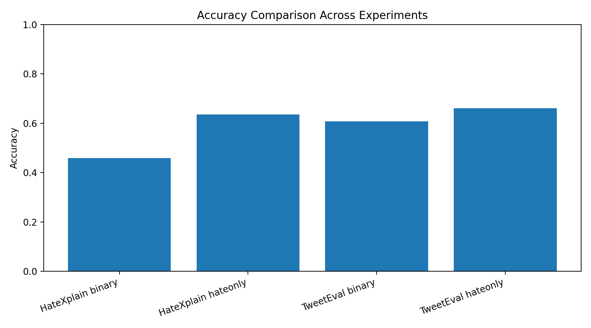
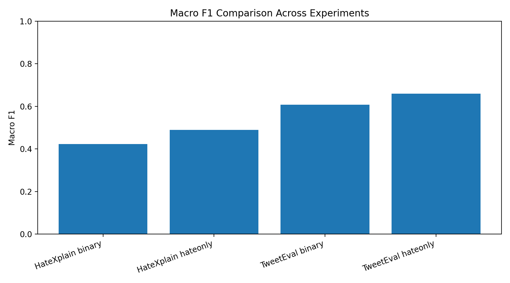
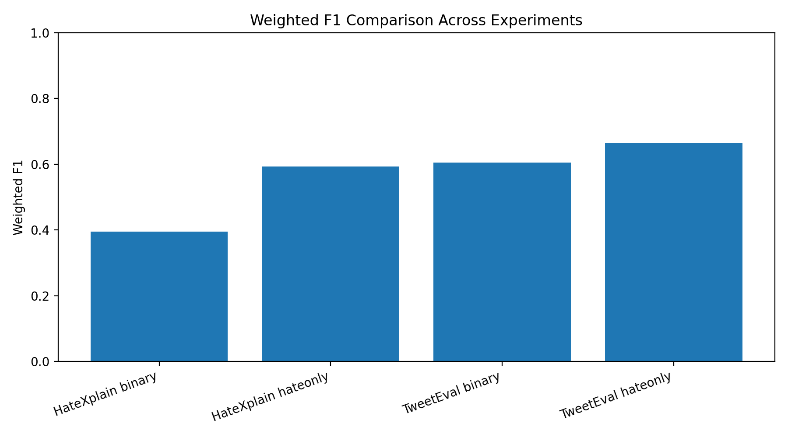
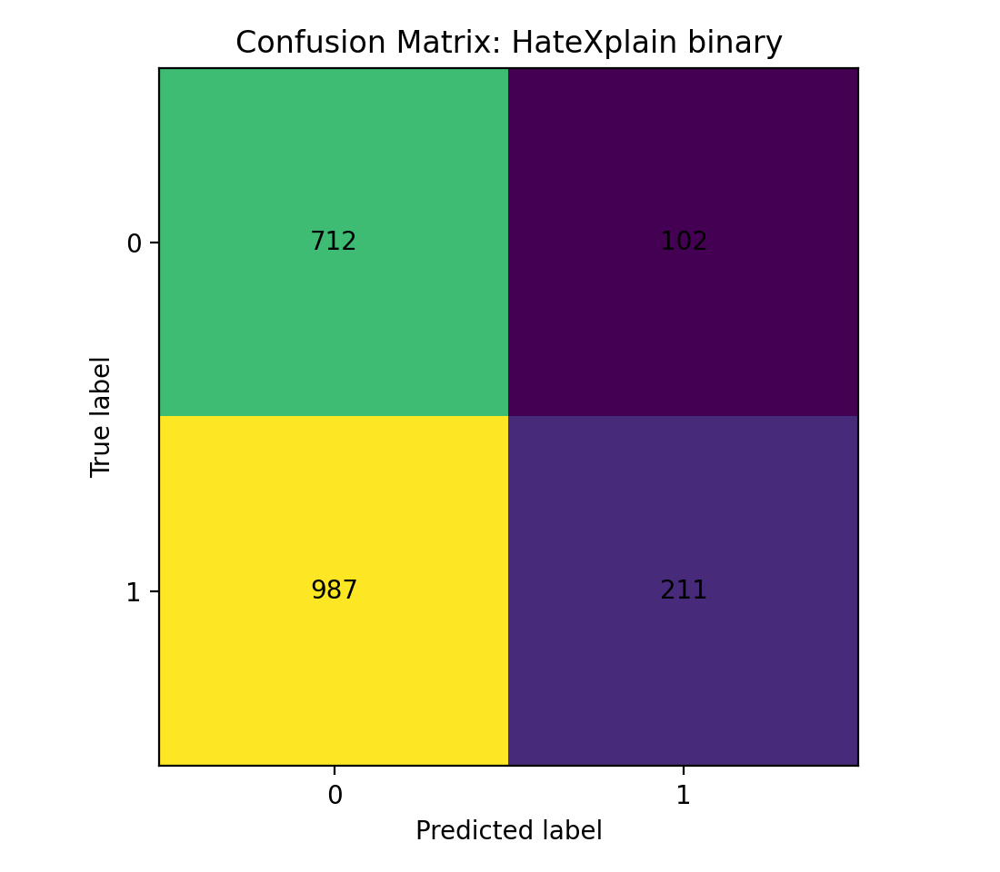
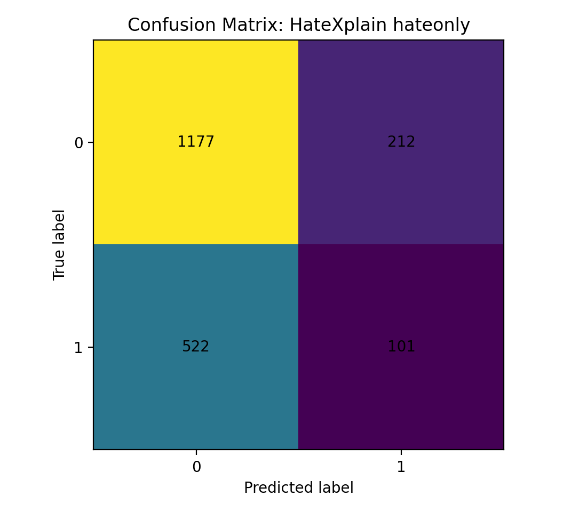
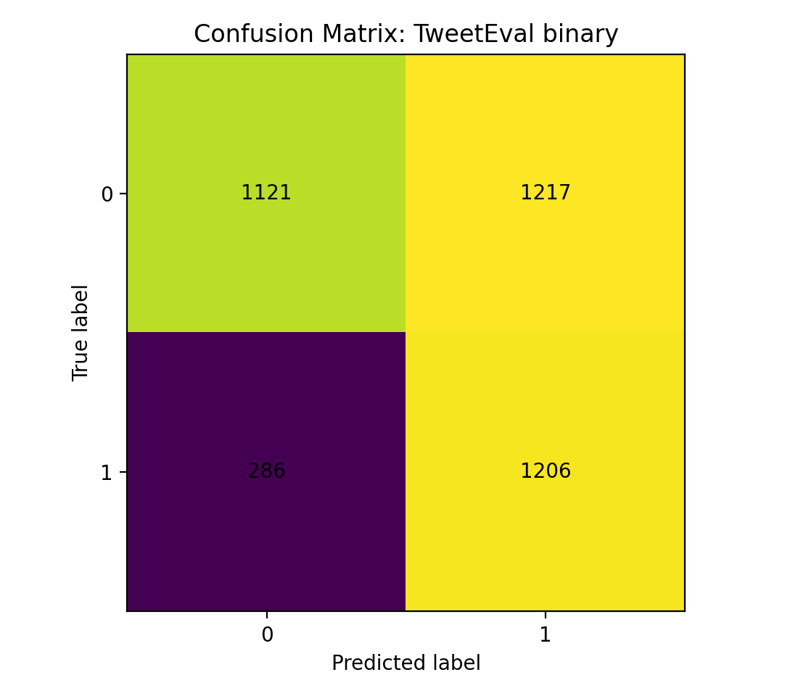
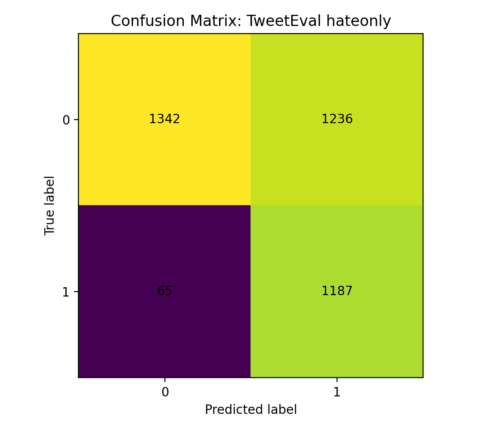

# Model 3 Report: twitter-roberta-base-hate

## 1. 实验目标
本部分评估现成模型 **`cardiffnlp/twitter-roberta-base-hate`** 在两个数据集上的表现：

- HateXplain
- TweetEval

由于该模型本质上是二分类 hate detection checkpoint，因此本实验没有直接做三分类评估，而是采用两种二分类映射方式进行比较。

---

## 2. 标签定义

原始统一三分类标签：

- `2 = hate`
- `1 = offensive`
- `0 = normal`

实验中使用了两种二分类映射：

### (1) binary
- `0 -> non-hate`
- `1 + 2 -> hate/abusive`

### (2) hateonly
- `0 + 1 -> non-hate`
- `2 -> hate`

---

## 3. 实验结果（Test Set）

| Dataset | Mapping | Accuracy | Macro F1 | Weighted F1 |
|---|---|---:|---:|---:|
| HateXplain | binary | 0.4587 | 0.4230 | 0.3955 |
| HateXplain | hateonly | 0.6352 | 0.4891 | 0.5931 |
| TweetEval | binary | 0.6076 | 0.6074 | 0.6055 |
| TweetEval | hateonly | 0.6603 | 0.6598 | 0.6645 |

---

## 4. 结果可视化

### Accuracy Comparison

### Macro F1 Comparison

### Weighted F1 Comparison

---

## 5. Confusion Matrix

### HateXplain binary

### HateXplain hateonly

### TweetEval binary

### TweetEval hateonly

---

## 6. 主要观察

1. **TweetEval 上的结果整体明显好于 HateXplain。**  
   说明该 off-the-shelf checkpoint 更贴近 TweetEval 风格的 hate detection 任务。

2. **hateonly 映射通常优于 binary 映射。**  
   说明该模型更适合做“严格的 hate detection”，而不是更宽泛的 offensive / abusive 检测。

3. **HateXplain 对该模型更有挑战性。**  
   同样的 checkpoint 在 HateXplain 上性能下降更明显，说明跨数据集迁移存在困难。

4. **标签映射方式会显著影响结果。**  
   将 positive class 定义为 `offensive + hate` 时，模型表现较差；当只检测 `hate` 时，结果更合理。

---

## 7. 阶段性结论

对于 Model 3 (`twitter-roberta-base-hate`) 而言：

- 最好的结果来自 **TweetEval + hateonly**
- 最差的结果来自 **HateXplain + binary**
- 整体来看，该模型更适合 **strict hate detection**
- 直接迁移到 HateXplain 时性能会明显下降

因此，这个模型可以作为本项目中的 **off-the-shelf baseline / comparison model**，同时也说明了数据集分布和标签定义对现成模型性能有很大影响。

---

## 8. 相关文件

- 结果汇总表：`visualizations/experiment_summary_metrics.csv`
- 可视化图表：`visualizations/`
- 评估脚本：
  - `evaluate_hatex_binary.py`
  - `evaluate_hatex_hateonly.py`
  - `evaluate_tweeteval_binary.py`
  - `evaluate_tweeteval_hateonly.py`

---